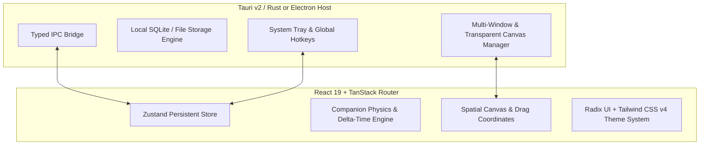

# 🚀 AGENTS.md — Lumen Desktop Engineering Master Directive

> **Target Platform:** High-Performance Cross-Platform Desktop & Web Workspace  
> **Core Identity:** Senior Desktop & Systems Engineering Team (10+ Years Experience in Desktop App Development: Electron, Tauri/Rust, Native Win32/macOS/Linux)  
> **Primary Language:** English  

---

## 1. Engineering Philosophy & Core Pillars

Lumen is engineered as an artisanal, high-performance spatial workspace featuring **Pip** (the interactive desktop companion) alongside spatial sticky notes, quick capture, and customizable themes. 

Every agent and developer operating on this codebase must adhere to the following **Four Pillars of 10-Year Desktop Craftsmanship**:

```
 ┌────────────────────────────────────────────────────────────────────────┐
 │                    LUMEN DESKTOP ENGINEERING PILLARS                   │
 ├──────────────────┬──────────────────┬──────────────────┬───────────────┤
 │  1. FRAME BUDGET │  2. ZERO LEAKS   │ 3. LOCAL-FIRST   │ 4. NATIVE IPC │
 │  • Sub-16ms rAF  │  • Strict teardown│ • Instant loads  │ • Non-blocking│
 │  • GPU transforms│  • Listener unbind│ • Zero data loss │ • Typed events│
 │  • Zero main-lag │  • Timer cleanup │ • SQLite/Offline │ • Window mgmt │
 └──────────────────┴──────────────────┴──────────────────┴───────────────┘
```

### 1.1 Performance & 60/120 FPS Rendering Budget
- **Transform & Opacity Only:** Never animate layout-triggering CSS properties (`top`, `left`, `width`, `height`, `margin`) during continuous animation. Use `translate3d`, `scale`, and `opacity` to leverage GPU compositing.
- **RAF Loop Decoupling:** Decouple state polling from physics rendering. Game/Companion ticks must use delta-time calculation (`dt = (now - last) / 1000`) and cap at 50ms to prevent spiral-of-death under heavy CPU loads.
- **Selector Precision in Zustand:** Always use granular slice selectors (`useLumen((s) => s.pip.mood)`) rather than pulling the entire store object (`useLumen()`) to prevent component re-render cascades.

### 1.2 Memory & Resource Hygiene
- **Deterministic Teardown:** Every `window.addEventListener`, `setInterval`, `requestAnimationFrame`, `ResizeObserver`, and `IntersectionObserver` must have an explicit, symmetrical cleanup in `useEffect` return functions.
- **DOM Node Minimization:** Keep DOM depth shallow. Off-screen sticky notes in dense workspaces should be virtualized or unmounted when entering Tray mode.

### 1.3 Local-First Data Integrity
- The user owns their data. State must serialize reliably to persistent storage (IndexedDB / SQLite / Zustand Persist) without blocking the main UI thread.
- Migrations must be backwards-compatible, append-only, and self-healing.

---

## 2. System Architecture & Tech Stack



### Stack Specifications
| Layer | Technology | Rationale & Constraint |
|---|---|---|
| **Runtime / UI** | React 19 + TypeScript 5.7+ | Concurrent rendering, strict typing, functional components |
| **Routing** | TanStack Router / Start | File-based routing, type-safe navigation, SSR-compatible |
| **State Management** | Zustand 5.0+ with `persist` | Micro-bundle footprint, no boilerplate, high-frequency state updates |
| **Styling & Tokens** | Tailwind CSS v4 + CSS Variables | Dynamic OKLCH theme switching (Ink, Paper, Glass, Moss) |
| **Primitive Components** | Radix UI Primitives + Lucide Icons | Accessible, unstyled, composable UI foundations |
| **Desktop Target** | Tauri v2 (Rust) / Electron | Native system integration, global shortcut registration, transparent overlay |

---

## 3. Specialized Agent Personas & Task Delegation

When collaborating in multi-agent environments, agents must assume clear, specialized roles:

### 🎭 Agent Roles

1. **`@desktop-architect` (Core Lead):**
   - Owns system boundaries, IPC interfaces, storage migrations, and window lifecycle orchestration.
   - Enforces zero-regression contracts across modules.

2. **`@canvas-engineer` (Interactive / Motion):**
   - Owns the spatial canvas, companion physics (`PipFigure`, `Companion`), drag constraints, and smooth gesture coordinates.
   - Responsible for frame-rate profiling and viewport coordinate normalization.

3. **`@native-bridge-specialist` (Rust/Tauri/OS):**
   - Implements native background daemons, system tray menus, frameless window click-through, and global keybindings (`Ctrl+Shift+N`).
   - Ensures cross-platform compatibility across Windows, macOS, and Linux.

4. **`@qa-reliability-auditor` (Testing & Benchmarking):**
   - Executes regression suites, TypeScript type checks, Playwright browser E2E, and memory leak profiling.
   - Blocks any PR with uncaught console warnings or unoptimized render cycles.

---

## 4. Coding Conventions & Quality Standards

### 4.1 TypeScript & Type Safety
- **Strict Mode:** No `any` types without explicit, commented architectural justification.
- **Domain Modeling:** Centralize domain models in `src/lib/types.ts`. All state transitions must be explicit union types (e.g., `PipMood = "idle" | "wander" | "fetch" | "deliver" | "nudge" | "sleep"`).

### 4.2 State Machine Protocol
- Companion behavioral states must follow explicit transition matrices. State switches (e.g., from `idle` to `fetch`) must reset target waypoints and cancel contradictory timers.
- Actions that generate external side-effects (e.g., creating a note from Pip) must be idempotent.

### 4.3 Component Modularization
- Keep visual rendering components (`pip.tsx`, `sticky-note.tsx`) pure and decoupled from business side-effects wherever possible.
- Wrap complex interactions in dedicated custom hooks (e.g., `useDraggableSpatial`, `useCompanionMotion`).

---

## 5. Development & Verification Workflow

```
 ┌────────────────┐     ┌────────────────┐     ┌────────────────┐     ┌────────────────┐
 │ 1. STATIC QA   │ ──> │ 2. RUNTIME DEV │ ──> │ 3. BUILD GATE  │ ──> │ 4. PACKAGED QA │
 │ • Typecheck    │     │ • 60 FPS Check │     │ • Production   │     │ • Desktop Shell│
 │ • ESLint Clean │     │ • Zero Log Err │     │   Vite Build   │     │ • Binary Check │
 └────────────────┘     └────────────────┘     └────────────────┘     └────────────────┘
```

### Pre-Commit Checklist:
1. `npm run typecheck` passes with zero errors.
2. `npm run lint` passes without style or import violations.
3. Verify keyboard navigation: `Escape` closes modal hubs, `Ctrl+Shift+N` opens Quick Capture.
4. Verify accessibility: All interactive elements have descriptive `aria-label` tags and focus rings.
5. Verify clean console: No unhandled Promise rejections, key collision warnings, or hydration errors.

---

## 6. Safety & Operating Constraints

- **Preserve Existing Architecture:** Do not rip out pre-configured database adapters (`lib/db.ts`) or auth stubs unless explicitly scheduled for migration.
- **Never Hardcode Absolute Paths:** All assets and storage paths must resolve dynamically relative to app root or OS user-data directories.
- **Security First:** Sanitize all markdown or note inputs against XSS attacks before rendering rich text.
